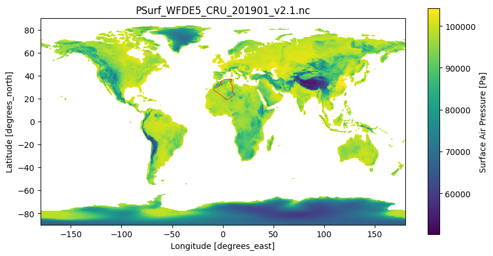
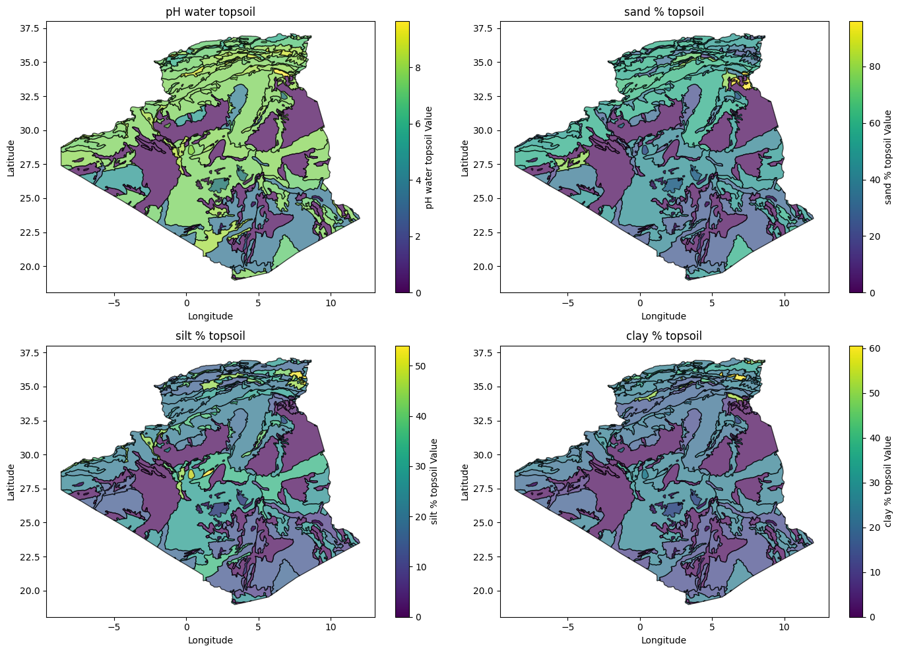
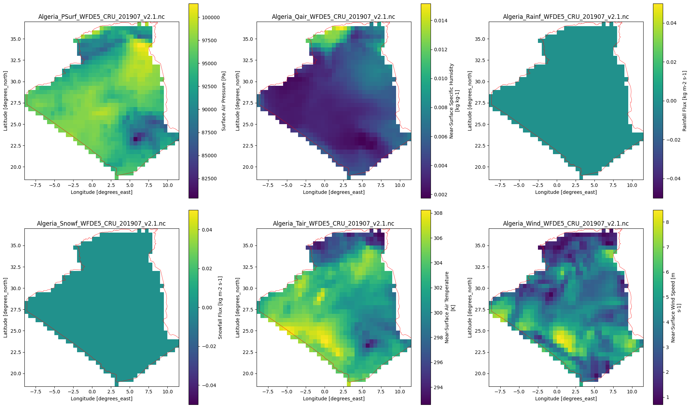

# Algeria Climate Analysis and Prediction

This project is divided into two phases, focusing on **data preparation** and **machine learning applications** using a climate dataset covering **Algeria**. The goal is to transform raw, heterogeneous data into actionable insights through systematic preprocessing, analysis, and predictive modeling.

---

## Collaborators  

| [](https://github.com/aymen-hadj-mebarek) | [](https://github.com/JasminCoding) | 
|:---------------------------------------------------------------------------------------------:|:---------------------------------------------------------------------------------------:|:---------------------------------------------------------------------------------------:|:---------------------------------------------------------------------------------------:|  
| **[Aymen HM.](https://github.com/yourusername)**                                               | **[Yasmine A.](https://github.com/JasminCoding)**                                         |

### **Phase 1: Data Preprocessing**

#### **Data Sources**  
- **Soil-DATA** : which contains soil properties of the Algerian territory.\
*you can find more infos about this data set [here](https://openknowledge.fao.org/server/api/core/bitstreams/149f1562-bf6a-439f-9d3a-eb93940f39cf/content) (for this one go to "Soil Attributes per depth layer")*\
**due to the size of the dataset, i couldnt upload it to Github. You can download the dataset using the api to have the exact data set i used from [here](#download-climate-data)**

- **Climate-DATA** : which contains climate variables of 2019 for the entire world.\
*you can find more infos about this data set [here](https://cds.climate.copernicus.eu/datasets/derived-near-surface-meteorological-variables?tab=overview)*
- **Country-DATA** : which contains country varuiables of the entire world.

#### **Dataset Overview**

- **Raw Data Format**: Climate and soil data stored in `.nc` (NetCDF) files, a format commonly used for multidimensional geospatial datasets (e.g., latitude, longitude, time).
    
- **Initial Data Shape**:
    
    - **Global Climate Data**: Dimensions of `(time=365, lat=1800, lon=3600)` with variables like temperature, precipitation, and humidity.
        
    - **Soil Data**: Similar spatial resolution but includes variables like soil moisture, pH, and texture.
        

---

#### **Key Preprocessing Steps**

1. **Extracting Algeria’s Data**
    
    - **Geospatial Filtering**:
        
        - Used a georeferenced Algeria boundary map (shapefile) to mask global NetCDF datasets.
            
        - Applied spatial indexing to extract data points within Algeria’s coordinates.
            
    - **Result**:
        
        - Reduced spatial dimensions to `(time=365, lat=450, lon=300)` for Algeria-specific climate and soil data.

    - **Visualization**:

        
            
2. **Data Integration**
    
    - **Merging Climate and Soil Datasets**:
        
        - Aligned datasets spatially (latitude/longitude) and temporally (daily timestamps).
            
        - Used `xarray` to merge variables into a unified dataset with shared dimensions.
            
    - **Challenges**:
        
        - Resolved mismatched resolutions via spatial averaging for soil data.
            
    - **Visualization**:
        
        
        
            
3. **Data Reduction**
    
    - **Aggregation by Seasons**:
        
        - Grouped daily data into seasons (Winter, Spring, Summer, Autumn) using time indices.
            
        - Calculated seasonal averages for each variable.
            
    - **Vertical Reduction**:
        
        - Removed redundant features (e.g., overlapping humidity metrics) using correlation analysis.
            
4. **Handling Missing Values & Outliers**
    
    - **Missing Values**:
        
        - Imputed gaps using seasonal averages (e.g., winter rainfall missing in summer).
            
    - **Outlier Detection**:
        
        - Identified anomalies using IQR (boxplots) and Z-score thresholds.
            
        - **Include Image 3**: `images/boxplot_outliers.png` (outliers in temperature data).
            
5. **Normalization & Discretization**
    
    - **Normalization**:
        
        - Applied Min-Max scaling to humidity and Z-score to temperature.
            
    - **Discretization**:
        
        - Binned continuous soil pH values into categories (e.g., acidic, neutral, alkaline) using equal-frequency binning.
            

---

#### **Phase 2: Model Training and Prediction**

- **Regression Task**:
    
    - **Goal**: Predict "Near-surface specific humidity" using **Decision Trees** and **Random Forest** algorithms.
        
    - **Workflow**: Split data into training/test sets, implement custom models, tune hyperparameters, and evaluate performance using metrics like RMSE and execution time.
        
    - **Benchmarking**: Compare custom implementations with library-based models (e.g., scikit-learn).
        
- **Clustering Task**:
    
    - **Goal**: Uncover hidden patterns using **CLARANS** (partition-based) and **DBSCAN** (density-based) algorithms.
        
    - **Workflow**: Implement clustering methods, analyze results with metrics (e.g., silhouette score), and visualize clusters using dimensionality reduction (PCA).
        

---

### **PyQt5 GUI Integration**

The project features a **custom PyQt5-based graphical interface** that seamlessly integrates both data preprocessing (Phase 1) and model training/prediction (Phase 2). Designed for flexibility, the GUI empowers users to:

1. **Preprocess Data Dynamically**:
    
    - Load merged data `csv files`
        
    - Apply preprocessing steps (e.g., seasonal aggregation, outlier removal, normalization) through an interactive workflow.
        
    - Visualize intermediate results (e.g., histograms, boxplots) to validate transformations.
        
2. **Train Custom Models**:
    
    - **Regression**:
        
        - Select features (e.g., latitude, temperature) and tune hyperparameters (max depth, number of trees) for Decision Trees or Random Forests.
            
        - Compare custom implementations with library-based scikit-learn models.
            
    - **Clustering**:
        
        - Adjust parameters like `epsilon` (DBSCAN) or `num_clusters` (CLARANS) and visualize clusters using PCA projections.
            
3. **Predict New Instances**:
    
    - Input new data via a form (e.g., temperature, soil moisture) and apply the same preprocessing pipeline used in training.
        
    - Generate humidity predictions (regression) or assign clusters (clustering) in real time.
        

---

### **Key GUI Components**

- **Modular Workflow**:
    
    - **`data_preprocess.py`**: Handles data loading, Algeria extraction, merging, and cleaning.
        
    - **`ModelTraining.py`**: Manages model initialization, training, and evaluation.
        
    - **`PredictForm.py`**: Provides a user-friendly form for inputting new data and displaying predictions.
        
- **Interactive Features**:
    
    - **Parameter Tuning**: Sliders and dropdowns to adjust preprocessing steps (e.g., normalization method) and model hyperparameters.
        
    - **Real-Time Visualization**: Embedded plots (e.g., cluster boundaries, regression curves) update dynamically with parameter changes.
        
    - **Progress Tracking**: A loading screen (`loading.py`) displays real-time status during data processing or model training.
        

---

### **Example Workflow**

1. **Load Data**:
    
    - Import global NetCDF files and filter to Algeria using `algeria_geo.png` boundaries.
        
2. **Preprocess**:
    
    - Aggregate data by season, remove outliers, and normalize features (Min-Max or Z-score).
        
3. **Train Models**:
    
    - Train a custom Random Forest with `n_estimators=100` and `max_depth=8`.
        
4. **Predict**:
    
    - Input new climate/soil values in `PredictForm.py` and receive a humidity prediction.
        

---

### **Code Structure Highlights**

- **Entry Point**: `main.py` initializes the GUI and connects all modules.
    
- **Custom Algorithms**:
    
    - `Decision_Tree.py` and `Random_Forest.py` contain scratch implementations for regression.
        
    - `CLARANS.py` and `DBSCAN.py` handle custom clustering logic.
        
- **Separation of Concerns**:
    
    - Preprocessing logic resides in `data_preprocess.py`, ensuring consistency between training and prediction phases.
        

---

### **Why PyQt5?**

- **User-Friendly**: Eliminates command-line dependency, making the tool accessible to non-technical users.
    
- **Adaptability**: Users can experiment with different preprocessing strategies and model configurations without modifying source code.
    
- **Reproducibility**: All steps (preprocessing → training → prediction) are logged and can be exported for auditability.
### **Tools & Technologies**:

- **Languages**: Python
    
- **Libraries**: pandas (data manipulation), scikit-learn (modeling), matplotlib/seaborn (visualization).        

### **Getting Started**  
1. Clone the repository:  
   ```bash  
   git clone https://github.com/aymen-hadj-mebarek/Algeria-climate-analysis.git
2. Install dependencies:
    
    ```bash
    pip install -r requirements.txt  
    ```
    
3. Run the GUI:
    
    ```bash
    python GUI/main.py
    ```